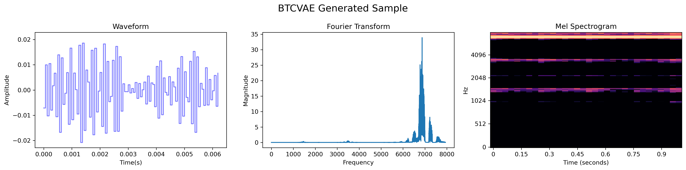

# Learning Disentangled Audio Representations through Controlled Synthesis

This is the reference implementation for the paper "Learning Disentangled Audio Representations through Controlled Synthesis," aimed at providing a comprehensive framework for experimenting with and evaluating audio disentanglement techniques.

## Abstract
In our paper, we address the challenge of limited benchmarking data in the field of disentangled auditory representation learning. We present *SynTone*, a novel synthetic dataset crafted with explicit ground truth explanatory factors, enabling a more precise evaluation of disentanglement methods. Our comprehensive benchmarking of several state-of-the-art approaches on SynTone effectively demonstrates its value for methodological assessment. The outcomes of our experiments reveal significant insights into the strengths and weaknesses inherent in current audio disentanglement practices, thereby paving the way for future advancements in the field.

## Table of Contents
- [Installation](#installation)
- [Dataset Creation](#dataset-creation)
- [Model Training](#model-training)
- [Evaluation](#evaluation)
- [Results](#results)
- [License](#license)
- [Citations](#citations)
- [Contact](#contact)

## Installation

This section outlines the necessary steps to install and run the code associated with our paper. It includes details on required dependencies and instructions for setting up the environment.

```bash
# First, clone the repository
git clone https://github.com/yusufbrima/SynTone.git

# Navigate to the project directory
cd SynTone

# Create a conda environment using the provided environment.yml file
conda env create -f environment.yml

# Activate the newly created environment
conda activate syntone
```

## Dataset Creation

**Script:** `create.py`

The `create.py` script is responsible for generating the *SynTone* dataset. This dataset is structured to include various audio features like frequency and amplitude, each with a range of values. Below are the instructions on how to use the script to create the dataset.

```bash
# To generate the SynTone dataset, run the following command:
python create.py --sample_rate 16000 --freq_start 400 --freq_end 8000 --num_freqs 100 --amp_start 0.1 --amp_end 1.0 --num_amps 10 --file_path "/path/to/dataset.npz"

# The above command will create a dataset with specified ranges of frequency and amplitude, sampled at 16kHz.
```

## Model Training

**Script:** `trainer.py`

This section provides detailed instructions for training models using the `trainer.py` script. It includes guidance on setting hyperparameters, estimated training duration, and the hardware requirements for efficient training.

```bash
# To train a model with the dataset, use the following command:
python trainer.py --file_path "/path/to/dataset.npz" --batch_size 16 --epochs 100 --latent_dim 8

# This command will train the model on the specified dataset for 100 epochs with a batch size of 16 and a latent dimension size of 8.
```

## Evaluation

**Script:** `evaluator.py`

The `evaluator.py` script is designed to evaluate the performance of the trained models using Supervised Disentanglement Metrics. This section details the necessary flags or parameters for effective model evaluation.

```bash
# Execute the following command to evaluate your model:
python evaluator.py --file_path "/path/to/dataset.npz" --batch_size 128 --num_experiments 10 --latent_dim 8

# This will evaluate the model over 10 experiments, each with a batch size of 128 and a latent dimension of 8.
```

## Results

This section showcases various visual representations of the results obtained from our experiments, including sample reconstructions, latent space traversal, and generative samples using different Variational Autoencoder (VAE) models.

### Sample Reconstruction 


### Sampling from the Learnt Latent Space


### VAE Encoding and Reconstruction


### VAE Sampling and Decoding


### VAE Latent Space Transversal


### BetaVAE Encoding and Reconstruction


### BetaVAE Sampling and Decoding


### BetaVAE Latent Space Transversal


### Factor

VAE Encoding and Reconstruction


### FactorVAE Sampling and Decoding


### FactorVAE Latent Space Transversal


### BTCVAE Encoding and Reconstruction


### BTCVAE Sampling and Decoding


### BTCVAE Latent Space Transversal


## License

This project is released under the MIT License. Below is the full text of the license:

MIT License

Copyright (c) 2024 

Permission is hereby granted, free of charge, to any person obtaining a copy
of this software and associated documentation files (the "Software"), to deal
in the Software without restriction, including without limitation the rights
to use, copy, modify, merge, publish, distribute, sublicense, and/or sell
copies of the Software, and to permit persons to whom the Software is
furnished to do so, subject to the following conditions:

The above copyright notice and this permission notice shall be included in all
copies or substantial portions of the Software.

THE SOFTWARE IS PROVIDED "AS IS", WITHOUT WARRANTY OF ANY KIND, EXPRESS OR
IMPLIED, INCLUDING BUT NOT LIMITED TO THE WARRANTIES OF MERCHANTABILITY,
FITNESS FOR A PARTICULAR PURPOSE AND NONINFRINGEMENT. IN NO EVENT SHALL THE
AUTHORS OR COPYRIGHT HOLDERS BE LIABLE FOR ANY CLAIM, DAMAGES OR OTHER
LIABILITY, WHETHER IN AN ACTION OF CONTRACT, TORT OR OTHERWISE, ARISING FROM,
OUT OF OR IN CONNECTION WITH THE SOFTWARE OR THE USE OR OTHER DEALINGS IN THE
SOFTWARE.


## Citation

If you use this code or dataset in your research, please cite our paper as follows:

```
@inproceedings{mypaper,
  title={Learning Disentangled Audio Representations through Controlled Synthesis},
  author={Under Review},
  booktitle={International Conference on Learning Representations (ICLR)},
  year={2024}
}
```

## Contact

For any inquiries regarding the implementation or the paper, feel free to reach out to us at 
<!-- [contact_email@example.com](mailto:contact_email@example.com). -->
```