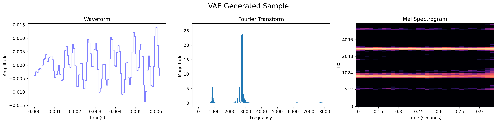

# Learning Disentangled Audio Representations through Controlled Synthesis

This is the reference implementation for the paper "Learning Disentangled Audio Representations through Controlled Synthesis".

## Abstract
This paper tackles the scarcity of benchmarking data in disentangled auditory representation learning. We introduce *SynTone*, a synthetic dataset with explicit ground truth explanatory factors for evaluating disentanglement techniques. Benchmarking state-of-the-art methods on SynTone highlights its utility for method evaluation. Our results underscore strengths and limitations in audio disentanglement, motivating future research.

## Table of Contents
- [Installation](#installation)
- [Dataset Creation](#dataset-creation)
- [Model Training](#model-training)
- [Evaluation](#evaluation)
- [Results](#results)
- [License](#license)
- [Citations](#citations)
- [Contact](#contact)

## Installation

Detail the steps required to install and run your code. Include information on dependencies and environment setup.

```bash
# Example installation steps
conda env create -f environment.yml
```

## Dataset Creation

**Script:** `create.py`

This script generates the *SynTone* dataset. Describe the dataset structure and how to execute the script.

```bash
# Example usage
python create.py --sample_rate 16000 --freq_start 400 --freq_end 8000 --num_freqs 100 --amp_start 0.1 --amp_end 1.0 --num_amps 10 --file_path "./Dataset/my_dataset.npz"
```

## Model Training

**Script:** `trainvae.py`

Instructions on how to train models. Include details about hyperparameters, training duration, and hardware requirements.

```bash
# Example usage
python trainvae.py --dataset /path/to/dataset --epochs 100
```

## Evaluation

**Script:** `eval.py`

Guide on how to evaluate the trained models using Supervised Disentanglement Metrics. Include any necessary flags or parameters.

```bash
# Example usage
python eval.py --model /path/to/trained_model
```

## Results

## Sample reconstruction 


## Sampling from the learnt latent space


## VAE Encoding and Reconstruction


## VAE Sampling and decoding


## VAE Latent Space Transversal


## BetaVAE Encoding and Reconstruction


## BetaVAE Sampling and decoding


## BetaVAE Latent Space Transversal


## FactorVAE Encoding and Reconstruction


## FactorVAE Sampling and decoding


## FactorVAE Latent Space Transversal


## BTCVAE Encoding and Reconstruction


## BTCVAE Sampling and decoding


## BTCVAE Latent Space Transversal


## License

Specify the license under which your project is released.


## Citation

If you use this code in your research, please cite the paper:

```
@inproceedings{mypaper,
  title={Learning Disentangled Audio Representations through Controlled Synthesis},
  author={Authors},
  booktitle={ICLR},
  year={2024}
}
```

## Contact

